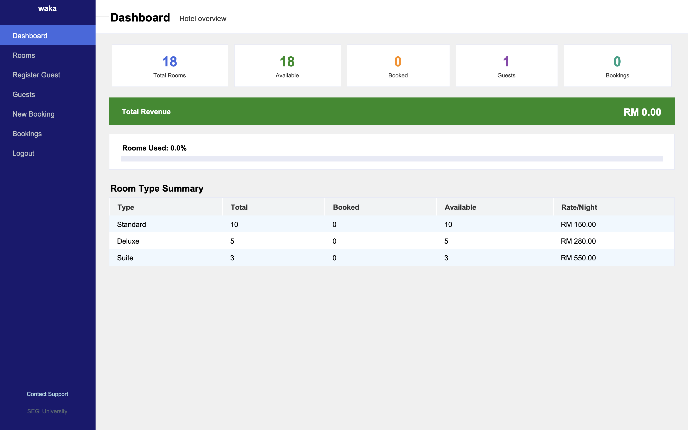

# WAKA Hotel Management System

Welcome to the **WAKA Hotel Management System**. This is a simple and easy-to-use program made for a university project to manage a hotel.

It has two versions that work together:
1. **The Window Version (GUI)**: A modern and beautiful window to click and manage rooms.
2. **The Terminal Version (CLI)**: A backup version that runs in the text command prompt if the window version fails.

---

## Dashboard Preview



---

##  Main Features

- **Dynamic Startup**: When you first run the program, you can choose your own Hotel Name and set your Admin Password.
- **Login System**: Secure login for both the window and terminal versions. It will say "Welcome back!" once you are set up.
- **Room Management**: Easy to see which rooms are free and which are booked.
- **Guest Registration**: A simple form to save guest details.
- **Automatic Receipts**: The system automatically makes a `.txt` receipt file for every booking in the `Receipts/` folder.
- **Safe Data**: All your information is saved automatically in the `data/` folder so you never lose it.

---

##  How to Run

1. Open your terminal (Command Prompt or Terminal).
2. Go to this folder.
3. Run the following command:
   ```bash
   python3 main.py
   ```
4. Follow the instructions on the screen!

---

##  Technical Details

This program uses **Object-Oriented Programming (OOP)** to make the code clean and organized:
- **Classes**: Different classes for `Hotel`, `Room`, `Guest`, and `Booking`.
- **Inheritance**: We have a main `Room` class, and specialized versions like `StandardRoom`, `DeluxeRoom`, and `SuiteRoom`.
- **Encapsulation**: Using private variables to keep the data safe.
- **File I/O**: Saving and loading all data using JSON files.

---

**Made by:** Waka
**For:** SEGi University Final Assessment
